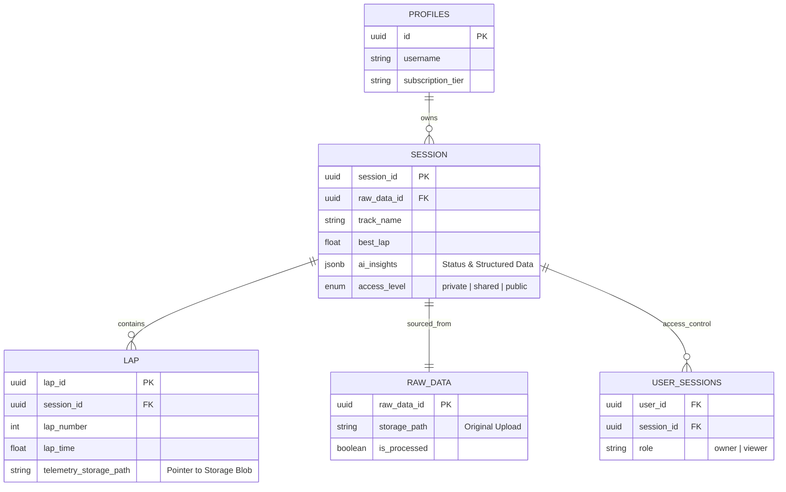

## Core Technology Stack
- **Frontend**: Next.js 15 (App Router), React 19
- **Styling**: Tailwind CSS v4, shadcn/ui
- **Database**: Supabase (PostgreSQL 15)
- **Data Storage**: Supabase Storage (S3-compatible) for bulk telemetry
- **AI**: Google Gemini Pro (via `@google/genai`)
- **Feature Flags**: Hypertune
- **Mapping**: Google Maps API
- **Processing**: TypeScript (Server Actions), `cubic-spline`, `geolib`, `@turf/turf`

## System Architecture

### 1. Hybrid Data Storage Strategy
We utilize a partial off-chain storage strategy to balance query performance with cost-effective bulk storage.

*   **Relational (PostgreSQL)**: Stores lightweight metadata, relationships, and pointers.
    *   `session`: High-level summary (track, driver, best lap, weather).
    *   `lap`: Indexed pointers to telemetry files per lap (`telemetry_storage_path`).
    *   `profiles`: User info and settings.
*   **Object Storage (Supabase Storage)**: Stores high-frequency time-series data.
    *   **Format**: Gzipped JSON.
    *   **Structure**: `lap-data-files/{user_id}/{session_id}/lap_{lap_number}.json.gz`
    *   **Content**: Array of `TelemetryPoint` objects (time, lat, long, speed, accel, etc.).

### 2. Data Processing Pipeline
Processing happens primarily via Server Actions (`upload-lap-data.ts` -> `process-lap-data.ts`) upon file upload.

1.  **Parsing**: Identifies format (TrackAddict, RaceChrono, CSV, VBO) and normalizes to `RawDataPoint`.
2.  **Interpolation**:
    *   **GPS (< 5Hz)**: Uses **Cubic Splines** (`cubic-spline`) to smooth trajectory.
    *   **GPS (>= 5Hz)**: Uses Linear interpolation.
    *   **Accelerometer**: Mean resampling to align with target time steps.
3.  **Lap Refinement**:
    *   Detects `START_FINISH` line from metadata or generates a **synthetic** one using geographic heuristics (closest point between start/end of raw laps).
    *   Calculates precise crossing points using `@turf/line-intersect`.
4.  **Compression**: The final interpolated points for each lap are serialized to JSON, Gzipped, and uploaded to storage.

> [!NOTE]
> For a detailed breakdown of the interpolation logic, crossing detection, and parsers, see the [[Data Pipeline]].

### 3. Large File Upload Strategy (Bypassing Vercel Limits)
To handle large telemetry files (often 10MB+) within Vercel's serverless environment (4.5MB payload limit), we utilize a **Direct-to-Storage** pattern.

1.  **Client-Side Processing (`file-uploader.tsx`)**:
    *   File is hashed (SHA-256) to check for duplicates.
    *   File is **Gzipped** in the browser using `pako`.
    *   Client uploads directly to Supabase Storage bucket (`lap-data-files`) using the Supabase Client.
2.  **Server processing (`upload-lap-data.ts`)**:
    *   Client calls Server Action with the file hash/path.
    *   Server Action downloads the file internally from Supabase Storage.
    *   Benchmarks show this reduces network payload by ~90% and completely bypasses the function body limit.

### 4. Real-time Communication
Real-time features (Chat, AI Analysis updates) rely on **Supabase Realtime**.

*   **Architecture**: "Database as the Engine of State".
*   **Write Path**: Users/Server Actions INSERT rows into `shared_chat_messages` or `private_ai_messages`.
*   **Read Path**: `ChatContext` maintains open WebSockets via `supabase.channel()`.
*   **Channels**:
    *   `shared_chat:{session_id}`: Listens for `INSERT/UPDATE` on `public.shared_chat_messages`.
    *   `ai_chat:{session_id}`: Listens for `INSERT/UPDATE` on `public.private_ai_messages` (scoped to user context).

### 5. AI Integration (Gemini)
AI analysis is an asynchronous, multi-stage process triggered after processing.

1.  **Context Construction**:
    *   Relevant session metadata.
    *   Summary statistics for all laps.
    *   Detailed telemetry samples from "Best Laps".
2.  **Stage 1: Initial Analysis**:
    *   **Model**: Gemini Pro.
    *   **Prompt**: `AI_INITIAL_ANALYSIS_PROMPT`. Generates a conversational summary of performance and areas for improvement.
    *   **Output**: Streamed to `private_ai_messages` as a chat entry.
3.  **Stage 2: Structured Insights**:
    *   **Prompt**: `AI_INSIGHTS_PROMPT` (fed with Stage 1 output).
    *   **Output**: Structured JSON (key opportunities, tags) saved to `session.ai_insights` column for UI display.

## Entity Relationship Diagram (ERD)

## Security & Access Control
*   **RLS (Row Level Security)**: Enforced at the database level.
*   **Policies**:
    *   `owner` (via `user_sessions`): Full CRUD.
    *   `viewer` (shared/public): Read-only.
*   **Storage Access**: **Service Role Proxy**. Telemetry files are downloaded server-side via the Supabase Service Role in `fetch-session-data.ts` to strictly enforce session-level permissions (checking RLS on the session first) before returning data to the client.
