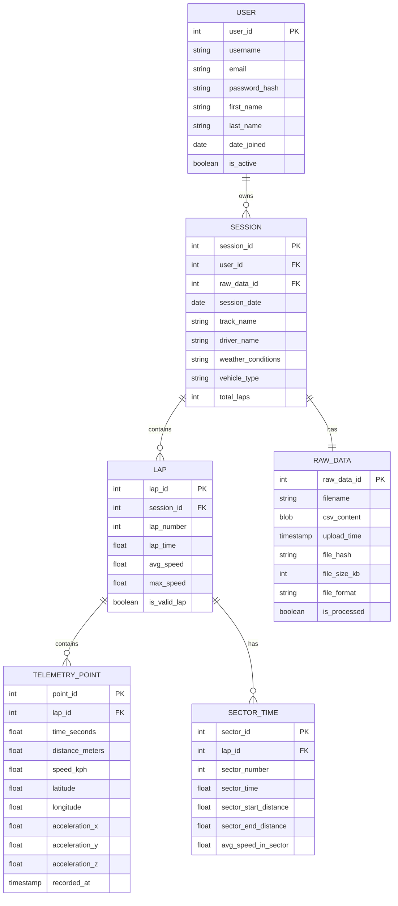

```mermaid
erDiagram
    USER ||--o{ SESSION : owns
    SESSION ||--o{ LAP : contains
    SESSION ||--|| RAW_DATA : has
    LAP ||--o{ TELEMETRY_POINT : contains
    LAP ||--o{ SECTOR_TIME : has
    
    USER {
        int user_id PK
        string username
        string email
        string password_hash
        string first_name
        string last_name
        date date_joined
        boolean is_active
    }
    
    SESSION {
        int session_id PK
        int user_id FK
        int raw_data_id FK
        date session_date
        string track_name
        string driver_name
        string weather_conditions
        string vehicle_type
        int total_laps
    }
    
    RAW_DATA {
        int raw_data_id PK
        string filename
        blob csv_content
        timestamp upload_time
        string file_hash
        int file_size_kb
        string file_format
        boolean is_processed
    }
    
    LAP {
        int lap_id PK
        int session_id FK
        int lap_number
        float lap_time
        float avg_speed
        float max_speed
        boolean is_valid_lap
    }
    
    SECTOR_TIME {
        int sector_id PK
        int lap_id FK
        int sector_number
        float sector_time
        float sector_start_distance
        float sector_end_distance
        float avg_speed_in_sector
    }
    
    TELEMETRY_POINT {
        int point_id PK
        int lap_id FK
        float time_seconds
        float distance_meters
        float speed_kph
        float latitude
        float longitude
        float acceleration_x
        float acceleration_y
        float acceleration_z
        timestamp recorded_at
    }
```

