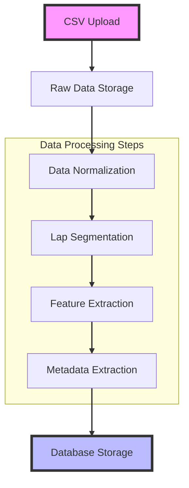

# Vision statement
An AI race engineer that helps track day enthusiasts go faster. The AI race engineer is able to look at lap data captured by lap timing apps (like Race Chrono or Track Addict) or exported from simulators (like Assetto Corsa Competizione) and provide insights on what a racer can do to improve their lap times. A text chat interface will allows the user to ask questions and get addition feedback.

# MVP Features
- Upload csv with lap data
	- TrackAddict and Race Chrono support
- Display dashboard of overlaid lap data
	- Number of laps in session
	- Fastest lap number and time
	- Fastest sectors
	- Speed over time/distance overlay
	- Lateral g over time/distance
- Chat interface to ask about the lap
- Select laps to be currently viewed/discussed from a session

Future features
- See [[Features+Ideas]]

# Tech stack
- Web app - Next.js
- Server data processing - Next.js server components / routes
- DB - Supabase free
- Hosting - Vercel free
- AI - Gemini free tier

## Data processing

- CSV Upload: Initial data is uploaded from a CSV file
- Raw Data Storage: Data is initially stored in its original format
- Data Normalization: Convert data to a consistent granularity/format
- Lap Segmentation: Divide the raw data into individual lap records
- Feature Extraction: Analyze and extract key performance metrics
- Metadata Extraction: Collect additional contextual information
- Database Storage: Persist processed data and insights

Features to collect:

